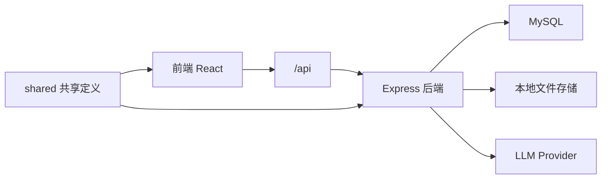

# SUPEREV 用研中心

SUPEREV 用研中心是一个面向内部团队的中文 AI 研究工作台，服务于“超级电动”新能源订阅业务。当前仓库已经从早期纯前端原型演进为可本地联调的前后端项目，核心目标是把“资料导入、AI 分析、反馈沉淀、Todo 跟进、Prompt 版本管理”串成一条可持续迭代的研究闭环。

## 当前项目状态

### 当前已接真实后端的核心链路

- 账号登录与会话维持
- 用户研究文档上传、列表、编辑、删除
- 用户研究文档分析
- Todo 新增、更新、删除
- 使用反馈新增、更新、列表
- Prompt 模块与 Prompt 版本管理

### 当前仍以高保真原型为主的模块

- 首页工作台
- 销转研究
- 数据中心
- 系统管理中的账号信息、角色权限、安全与隐私
- 舆情研究、行业研究、员工研究

### 当前真实分析范围

- 当前只对“用户研究”模块开放真实分析链路
- 当前真实分析文件格式只支持 `docx` 和 `txt`
- `pdf/png/jpg/jpeg` 暂不进入真实分析，需要先转成可复制文本
- 访谈分析 6 个结果页签已恢复真实展示；其中“完整报告”由前端拼接速览、旅程图、洞察、画像、行动建议 5 个结果生成
- “行动建议”页签中的建议类型、紧迫程度、认知负荷评级等枚举值，当前统一按中文展示
- “旅程图”页签当前采用固定列数 + 横向滚动布局，避免阶段卡片自动换行，并统一情绪/描述的字体层级

## 技术栈

### 前端

- `React 19`
- `Vite 6`
- `TypeScript`
- `Tailwind CSS 4`
- `lucide-react`
- `react-markdown`
- `remark-gfm`

### 后端

- `Node.js`
- `TypeScript`
- `Express`
- `express-session`
- `express-mysql-session`
- `multer`
- `zod`

### 数据与模型

- `MySQL`
- 文件存储：`backend/storage/source-documents/`
- 模型提供方：
  - `gemini`
  - `deepseek`

## 当前架构



### 运行时职责分工

- 前端负责页面交互、状态展示、API 调用和结果可视化
- 后端负责登录会话、文件接收、文本解析、数据库持久化、Prompt 版本读取和模型调用
- `shared/` 负责前后端共享的 Prompt 默认值、分析结果标准化逻辑和领域枚举

## 当前核心能力

## 1. 登录与会话

- 前端启动后会先请求 `GET /api/auth/me` 尝试恢复登录状态
- 登录态通过 `HttpOnly Cookie + express-session` 保存
- 用户连续 12 小时无页面交互会自动退登
- 活跃事件包括点击、键盘输入、鼠标移动、滚动、触摸和窗口重新聚焦

## 2. 用户研究文档管理

- 上传入口位于“访谈分析”和“系统管理 > 数据入口”
- 上传后原文件落盘到 `backend/storage/source-documents/YYYY/MM/`
- 后端会抽取文档文本并写入 `research_documents`
- 同一业务线下，同名文档会自动去重，只保留最新一份

## 3. 访谈分析

- 当前真实分析链路只支持 `docx/txt`
- 上传成功后，前端通过 `POST /api/documents/:id/analyze` 触发分析
- 后端会读取当前模块已发布 Prompt 版本
- 分析结果写回 `research_documents.analysis_result`
- 前端展示以下结构：
  - 速览
  - 洞察
  - 旅程图
  - 画像
  - 行动建议
  - 完整报告

### 当前分析流水线

当前后端已经收敛为两段式，而不是旧版多段并发：

1. 主分析：一次生成 `summary / insights / journey / persona`
2. 行动建议：基于已生成洞察，再单独生成 `actions`

这意味着当前每次分析通常会触发 2 次模型请求，而不是早期文档里写的“多个板块分别并发调用”。

## 4. 用户画像

- 只读取“用户研究”模块下已完成分析的文档
- 支持业务线、时间范围、受访对象筛选
- 选中 `0` 或 `1` 个对象时默认单体画像
- 选中 `2` 个及以上时默认聚合画像
- 旅程图、事实卡、标签和摘要都来自真实分析结果，不再使用静态样例

## 5. 使用反馈

- 访谈分析页里的反馈先在当前页面暂存
- 只有点击“确认并同步”后才写入后端 `feedbacks`
- 反馈会保存：
  - 模块
  - 业务线
  - 赞/踩
  - 问题归因
  - 原声反馈
  - AI 评价总结
  - AI 优化建议

## 6. Todo 管理

- Todo 已接后端 `todos`
- 支持新增、编辑、删除、状态流转
- 可记录来源模块、来源文档、来源业务线快照

## 7. Prompt 管理

- 支持 5 个核心模块：
  - 用户研究
  - 销转研究
  - 行业研究
  - 舆情研究
  - 员工研究
- 每个模块独立维护版本
- 支持：
  - 草稿
  - 已发布
  - 已归档

当前真正接入模型调用的模块仍是“用户研究”。

## 数据存储

当前核心表包括：

- `users`
- `auth_sessions`
- `prompt_modules`
- `prompt_versions`
- `research_documents`
- `feedbacks`
- `todos`
- `legacy_import_batches`

说明：

- 浏览器 `localStorage` 不再承担主业务持久化
- `localStorage` 只保留给旧版迁移导出页使用

## 本地运行

## 1. 安装依赖

```bash
npm install
npm install --prefix backend
```

## 2. 配置环境变量

### 前端环境变量

项目根目录 `.env.local`：

```bash
VITE_API_BASE_URL=
VITE_API_PROXY_TARGET=http://127.0.0.1:3001

# 可选：如果后端需要走本机代理再访问外网模型
BACKEND_PROXY_URL=http://127.0.0.1:7890
BACKEND_NO_PROXY=127.0.0.1,localhost
```

### 后端环境变量

后端环境变量位于：

- `backend/.env`
- 可参考 `backend/.env.example`

典型配置包括：

```bash
PORT=3001
FRONTEND_ORIGIN=http://127.0.0.1:3000
FRONTEND_ORIGINS=http://127.0.0.1:3000
SESSION_SECRET=your_session_secret
SESSION_COOKIE_SAME_SITE=lax
SESSION_COOKIE_SECURE=false

MYSQL_HOST=your_mysql_host
MYSQL_PORT=3306
MYSQL_DATABASE=superev_research_center
MYSQL_USER=superev_app
MYSQL_PASSWORD=your_app_password

MYSQL_INIT_HOST=your_mysql_host
MYSQL_INIT_ROOT_USER=root
MYSQL_INIT_ROOT_PASSWORD=your_root_password
MYSQL_INIT_DATABASE=superev_research_center
MYSQL_INIT_APP_USER=superev_app
MYSQL_INIT_APP_PASSWORD=your_app_password

ADMIN_ACCOUNT=admin@superev.com
ADMIN_NAME=系统管理员
ADMIN_PASSWORD=your_admin_password
ADMIN_ROLE=管理员

LLM_PROVIDER=gemini
GEMINI_BASE_URL=https://generativelanguage.googleapis.com
GEMINI_API_KEY=your_google_api_key
GEMINI_MODEL=gemini-2.5-flash
DEEPSEEK_BASE_URL=https://api.deepseek.com
DEEPSEEK_API_KEY=your_deepseek_api_key
DEEPSEEK_MODEL=deepseek-chat
DOCUMENT_STORAGE_MODE=local
DOCUMENT_MAX_FILE_SIZE_MB=10

# 兼容旧配置时，也可以继续保留以下字段作为 DeepSeek 的兼容别名
# LLM_BASE_URL=https://api.deepseek.com
# LLM_API_KEY=your_deepseek_api_key
# LLM_MODEL=deepseek-chat
```

## 3. 初始化数据库

```bash
npm run db:init
```

作用：

- 创建数据库和应用账号
- 创建核心表结构

## 4. 启动开发环境

```bash
npm run dev
```

这个命令会同时启动：

- 前端：`3000`
- 后端：`3001`

默认访问地址：

```text
http://127.0.0.1:3000
```

如果你更习惯桌面双击方式，也可以直接运行：

- `/Users/shirenyuan/Desktop/AI编程/superev用研中心/启动本地部署.command`

## 5. 单独启动

```bash
npm run dev:frontend
npm run dev:backend
```

## 6. 生产构建

```bash
npm run build
```

这个命令会同时构建：

- 前端静态资源
- 后端 TypeScript 输出

## 7. Vercel 部署

当前仓库已经补齐了 Vercel 所需入口：

- `api/index.js` 作为 Vercel Function 入口
- `backend/src/vercel.ts` 复用 Express app，但不再依赖 `app.listen()`
- `vercel.json` 负责安装根依赖和 `backend/` 依赖，并输出前端静态资源

建议生产环境至少配置：

```bash
NODE_ENV=production
FRONTEND_ORIGIN=https://your-frontend-domain.vercel.app
FRONTEND_ORIGINS=https://your-frontend-domain.vercel.app
SESSION_SECRET=replace_with_a_long_random_secret
SESSION_COOKIE_SAME_SITE=none
SESSION_COOKIE_SECURE=auto
DOCUMENT_STORAGE_MODE=memory
DOCUMENT_MAX_FILE_SIZE_MB=10
VITE_API_BASE_URL=
```

说明：

- `DOCUMENT_STORAGE_MODE=memory` 适合 Vercel，无需依赖本地持久磁盘
- `SESSION_COOKIE_SAME_SITE=none` + `SESSION_COOKIE_SECURE=auto` 适合 HTTPS 下的生产登录态
- 如果前后端同域部署，`VITE_API_BASE_URL` 可保持为空，前端直接访问同域 `/api`
- 如果前后端分域部署，`VITE_API_BASE_URL` 需要改成后端域名，并把前端域名加入 `FRONTEND_ORIGINS`

### 当前仓库在 Vercel 的正式 API 地址规则

如果你把当前仓库整体部署到同一个 Vercel 项目：

- 前端页面地址：`https://your-project.vercel.app`
- 正式后端 API 地址：`https://your-project.vercel.app/api`

例如：

```text
https://your-project.vercel.app/api/health
https://your-project.vercel.app/api/auth/login
```

这种场景下，不需要单独再写一个线上后端域名，前端保持：

```bash
VITE_API_BASE_URL=
```

就可以了。

## 8. 权限与隐私

当前后端已经补齐了基础权限控制：

- Prompt 版本查看、创建、发布仅管理员可用
- 文档查看仅 `管理员 / 用研角色 / 销售角色` 可用
- 文档上传、分析、编辑、删除仅 `管理员 / 用研角色` 可用
- Todo 与使用反馈仅 `管理员 / 用研角色` 可用

上传文档后，系统会先做敏感信息脱敏，再写入数据库并返回前端。当前已覆盖：

- 手机号
- 身份证号
- 邮箱
- 中文详细地址

## 9. 旧数据迁移

### 导出旧版 localStorage 数据

开发环境访问：

```text
http://127.0.0.1:3000/?page=legacy-export
```

### 导入 MySQL

```bash
npm run legacy:import -- /absolute/path/to/export.json
```

## 目录结构

```text
.
├── README.md
├── docs/
│   ├── change-log.md
│   ├── design.md
│   ├── domain-background.md
│   ├── prd.md
│   └── prompt-guide.md
├── src/
├── backend/
│   ├── src/
│   ├── storage/
│   └── package.json
├── shared/
├── scripts/
├── package.json
├── vite.config.ts
└── 启动本地部署.command
```

## 核心接口

- `POST /api/auth/login`
- `GET /api/auth/me`
- `POST /api/auth/logout`
- `GET /api/documents`
- `POST /api/documents/upload`
- `PATCH /api/documents/:id`
- `DELETE /api/documents/:id`
- `POST /api/documents/:id/analyze`
- `GET /api/todos`
- `POST /api/todos`
- `PATCH /api/todos/:id`
- `DELETE /api/todos/:id`
- `GET /api/feedbacks`
- `POST /api/feedbacks`
- `PATCH /api/feedbacks/:id`
- `GET /api/prompt-modules`
- `GET /api/prompt-modules/:code/versions`
- `POST /api/prompt-modules/:code/versions`
- `PATCH /api/prompt-versions/:recordId`
- `POST /api/prompt-versions/:recordId/publish`

## 文档索引

- 产品需求文档：`docs/prd.md`
- 提示词文档：`docs/prompt-guide.md`
- 设计文档：`docs/design.md`
- 背景知识文档：`docs/domain-background.md`
- 变更记录：`docs/change-log.md`
- Vercel 安全部署说明：`docs/vercel-secure-deploy.md`

## 已知限制

- 当前只有“用户研究”接入了真实模型分析
- 当前真实分析文件类型只支持 `docx/txt`
- 数据中心、销转研究、行业研究、舆情研究、员工研究仍主要是原型页
- 账号信息、角色权限、安全与隐私页目前还是展示型配置页
- 当前未做分析结果缓存；同一文档重复分析仍会重复请求模型
- 文件去重规则目前是“同业务线 + 同文件名”，不是内容哈希
- 会话管理已真实化，但权限细粒度控制仍未真正落地

## 建议的下一步

- 为销转研究接入真实数据源和模型
- 为数据中心补齐真实查询与资产关系
- 引入分析结果缓存和任务队列
- 补齐角色权限和审计能力
- 为 `pdf/png/jpg` 引入可控的解析路径
