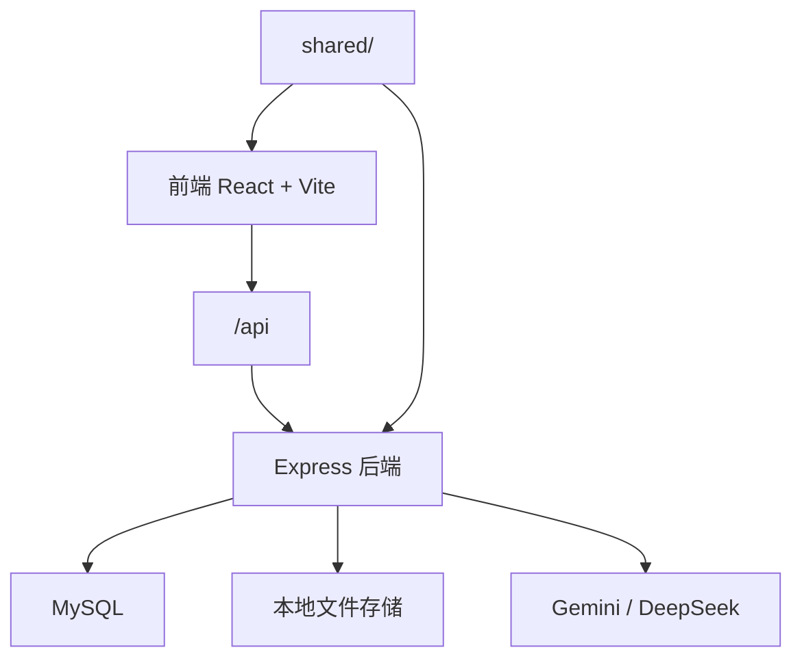

# 设计文档

## 1. 文档目的

本文档描述 SUPEREV 用研中心当前版本的系统设计、模块结构、状态管理、数据流和工程边界。

当前项目已经不是早期“纯前端原型”，而是：

- 前端 React 工作台
- 后端 Express API
- MySQL 持久化
- 本地文件存储
- 前后端共享领域定义

## 2. 设计原则

- 中文优先：界面、提示、错误文案默认中文
- 核心闭环优先：先把“用户研究”主闭环做实
- 平台骨架先行：即使模块未接真实能力，也先把导航和治理骨架搭好
- 前后端分责明确：前端负责展示和交互，后端负责状态与数据真实化
- 可迁移：为旧版 localStorage 数据提供导出与导入路径

## 3. 总体架构



## 4. 目录设计

```text
.
├── src/                    # 前端
├── backend/
│   ├── src/
│   │   ├── config/
│   │   ├── constants/
│   │   ├── db/
│   │   ├── middlewares/
│   │   ├── routes/
│   │   ├── scripts/
│   │   ├── services/
│   │   ├── types/
│   │   ├── utils/
│   │   ├── app.ts
│   │   └── server.ts
│   ├── storage/
│   └── package.json
├── shared/                 # 前后端共享定义
├── scripts/                # 启动和运行辅助脚本
├── docs/
└── README.md
```

## 5. 前端设计

## 5.1 顶层应用

前端顶层由 `src/App.tsx` 管理：

- 登录状态恢复
- 后端不可用提示
- 当前页面切换
- 统一退登逻辑
- 开发环境旧数据导出页入口

当前仍未引入路由库，页面切换方式仍是：

- `currentPage` 字符串驱动

这意味着：

- 好处：结构直观、改动快
- 代价：没有 URL 路由、没有深链接、没有路由级权限控制

## 5.2 页面信息架构

- 首页
- 用户研究
  - 访谈分析
  - 用户画像
  - Todo 管理
  - 使用反馈
- 销转研究
- 行业研究
- 舆情研究
- 员工研究
- 数据中心
- 系统管理
  - 账号信息
  - 角色权限
  - 提示词管理
  - 数据入口
  - 安全与隐私

## 5.3 前端状态层

当前前端共享状态由 `src/lib/store.ts` 的 `RemoteStore` 负责。

它不再是旧版本地 `localStorage` store，而是 API 驱动的内存态缓存层：

- `documents`
- `feedbacks`
- `todos`
- `promptVersionsByModule`

### 主要职责

- 启动时从后端批量加载数据
- 为页面提供统一的订阅更新机制
- 负责文档、反馈、Todo、Prompt 版本的本地缓存刷新
- 把后端返回结构标准化为前端易消费格式

## 5.4 API 封装

`src/lib/api.ts` 负责：

- 统一 `fetch`
- 自动携带 `credentials: include`
- 统一 JSON 解析
- 统一错误抛出为 `ApiError`

这保证了登录态和所有业务 API 共用同一套请求行为。

## 6. 后端设计

## 6.1 应用入口

后端入口：

- `backend/src/app.ts`
- `backend/src/server.ts`

`app.ts` 负责：

- 初始化运行时种子数据
- 建立会话中间件
- 配置 CORS
- 注册 API 路由
- 注册全局错误处理中间件

## 6.2 当前路由

- `/api/auth`
- `/api/documents`
- `/api/todos`
- `/api/feedbacks`
- `/api/prompt-modules`
- `/api/prompt-versions`

## 6.3 会话设计

后端使用：

- `express-session`
- `express-mysql-session`

会话存储在 MySQL 表 `auth_sessions`。

前端通过 Cookie 自动带会话，后端通过 `requireAuth` 中间件保护业务接口。

### 当前会话特征

- Cookie 为 `HttpOnly`
- `sameSite=lax`
- 当前开发环境 `secure=false`
- 采用 rolling session
- 空闲超时时间来自环境变量，默认 12 小时

## 6.4 运行时自举

`backend/src/db/bootstrap.ts` 会在应用启动时自动确保：

- 存储目录存在
- 管理员种子账号存在
- Prompt 模块种子数据存在
- Prompt 默认版本存在

这保证本地第一次跑起来时不需要再手工补模块和初始 Prompt。

## 7. 数据设计

## 7.1 核心表

当前表结构定义在 `backend/src/constants/schema.ts`：

- `users`
- `auth_sessions`
- `prompt_modules`
- `prompt_versions`
- `research_documents`
- `feedbacks`
- `todos`
- `legacy_import_batches`

## 7.2 关键数据关系

### 文档

`research_documents` 记录：

- 原始文件名
- 落盘文件名
- 文件路径
- 文件格式
- 文件大小
- 业务线
- 受访对象
- 抽取文本
- 分析结果 JSON
- 所属 Prompt 模块
- 实际使用的 Prompt 版本
- 所属模型提供方和模型名

### Prompt

Prompt 拆成两层：

- `prompt_modules`
- `prompt_versions`

这样做的目的是：

- 不同研究模块独立维护 Prompt
- 每次发布可以保留历史版本
- 文档分析时可以追溯到底用了哪个版本

### 反馈

`feedbacks` 记录：

- 模块
- 业务线
- 赞 / 踩
- 问题归因
- 反馈原声
- AI 评价总结
- AI 优化建议
- 来源文档

### Todo

`todos` 记录：

- 类型
- 内容
- 提及人数
- 部门
- 当前进度
- 状态
- 来源模块
- 来源文档快照
- 来源业务线快照

## 8. 文件存储设计

文档上传后落盘到：

- `backend/storage/source-documents/YYYY/MM/`

当前存储设计特点：

- 按年月分目录
- 文件名改为时间戳 + 随机串
- 数据库保留原始文件名和相对路径

当前去重规则：

- 同一业务线下
- 同一原始文件名
- 视为同一文档，只保留最新记录

## 9. 文档分析设计

## 9.1 上传与解析

当前文档上传路径：

- `POST /api/documents/upload`

后端行为：

1. 校验文件类型
2. 保存文件
3. 抽取文本
4. 写入 `research_documents`

当前真实支持：

- `docx`
- `txt`

当前解析方式：

- `docx`：`mammoth`
- `txt`：直接读文本

## 9.2 分析触发

分析路径：

- `POST /api/documents/:id/analyze`

后端行为：

1. 读取文档文本
2. 读取当前模块已发布 Prompt
3. 调用分析服务
4. 写回结果和分析元数据

## 9.3 当前分析流水线

当前 `backend/src/services/analysis.ts` 已收敛为两段式：

### 第一步：主分析

一次生成：

- `summary`
- `insights`
- `journey`
- `persona`

### 第二步：行动建议

在已有洞察基础上，再生成：

- `actions`

并要求 `insightRef` 指向对应“洞察#N”。

### 当前价值

- 比旧版多次拆分更简单
- 更容易维护

### 当前问题

- 仍然是多次模型调用，不是单次完成
- 尚未做结果缓存
- 长材料和长 Prompt 仍会明显放大耗时

## 9.4 模型提供方选择

后端当前支持两个提供方，并默认优先使用 Gemini：

- `gemini`
- `deepseek`

Gemini 路径：

- 使用 `@google/genai`
- 默认模型：`gemini-2.5-flash`
- 任一阶段首次失败后，立即尝试 DeepSeek 作为 fallback
- 一旦本次分析切到 DeepSeek，后续阶段保持使用 DeepSeek
- 不再做 Gemini 模型内切换或整条 pipeline 重跑

DeepSeek 路径：

- 走 OpenAI 兼容 `chat/completions`
- 默认模型：`deepseek-chat`
- 支持显式变量 `DEEPSEEK_API_KEY / DEEPSEEK_MODEL / DEEPSEEK_BASE_URL`
- 旧的 `LLM_API_KEY / LLM_MODEL / LLM_BASE_URL` 仅作为 DeepSeek 的兼容别名

## 10. Prompt 设计与治理

Prompt 默认值来自：

- `shared/prompt-defaults.ts`

运行时已发布版本来自：

- `prompt_versions`

前端的 Prompt 管理页负责：

- 查看模块
- 查看版本
- 保存草稿
- 发布版本

后端的 Prompt 路由负责：

- 创建新版本
- 更新版本内容
- 发布版本

## 11. 前后端共享层设计

`shared/` 当前主要承载：

- 领域常量
- Prompt 默认值
- 分析结果标准化逻辑

作用：

- 避免前后端重复维护同一份模块列表和枚举
- 让前端能稳定消费后端结果

## 12. 旧数据迁移设计

为了把旧版浏览器数据迁到新后端，当前保留了两部分能力：

### 前端导出

- `src/pages/LegacyExport.tsx`
- 通过 `?page=legacy-export` 打开

### 后端导入

- `backend/src/scripts/import-legacy-json.ts`

这条链路可把：

- 文档
- 反馈
- Todo
- Prompt 版本

从旧 JSON 包导入到 MySQL。

## 13. 开发与运行设计

### 根脚本

- `npm run dev`
- `npm run dev:frontend`
- `npm run dev:backend`
- `npm run build`
- `npm run db:init`
- `npm run legacy:import`

### 启动辅助

- `scripts/dev.ts`：同时拉起前后端
- `scripts/run-backend.mjs`：处理后端代理探测和启动
- `启动本地部署.command`：桌面双击启动

## 14. 当前设计债务

- 前端仍没有路由体系
- 数据中心仍未接真实数据层
- 多数系统管理页还是展示页
- 文件类型支持仍偏窄
- 分析服务仍没有缓存和异步任务机制
- 当前权限体系还停留在基础登录层

## 15. 推荐演进方向

### 阶段一

- 为分析结果增加缓存
- 为数据中心接真实查询
- 为销转研究接真实分析

### 阶段二

- 引入路由和更清晰的页面级状态组织
- 为分析任务引入异步队列和进度反馈
- 扩展文件解析能力

### 阶段三

- 补齐权限治理
- 打通连接器
- 建立跨模块资产关系
