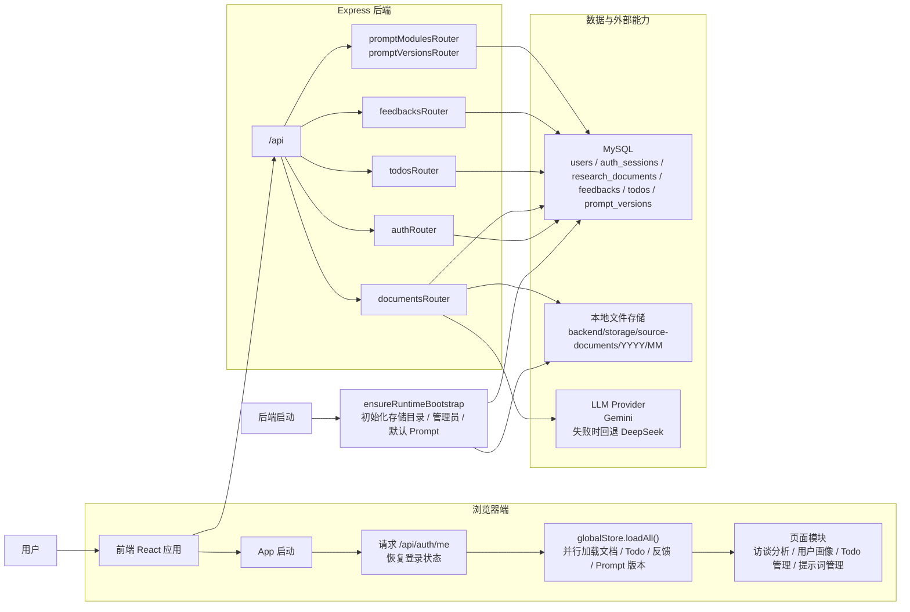
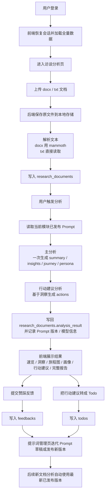
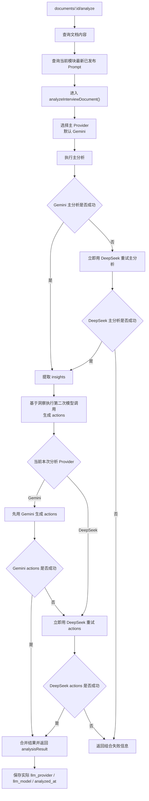

# SUPEREV 用研中心流程图

这份流程图基于当前仓库真实实现整理，不按早期原型推演。

当前需要特别注意：

- 真实分析链路目前只接入`用户研究`
- 真实上传与分析目前只支持 `docx` 和 `txt`
- `销转研究 / 舆情研究 / 行业研究 / 员工研究 / 数据中心 / 首页` 仍以高保真原型或结果消费页为主

## 1. 项目总体运行流程

## 2. 用户研究主闭环

## 3. 分析服务内部流程

## 4. 图中对应的核心代码

- 前端入口：[src/App.tsx](/Users/shirenyuan/Desktop/AI编程/superev用研中心/src/App.tsx)
- 前端数据层：[src/lib/store.ts](/Users/shirenyuan/Desktop/AI编程/superev用研中心/src/lib/store.ts)
- 前端 API 封装：[src/lib/api.ts](/Users/shirenyuan/Desktop/AI编程/superev用研中心/src/lib/api.ts)
- 访谈分析页：[src/pages/InterviewAnalysis.tsx](/Users/shirenyuan/Desktop/AI编程/superev用研中心/src/pages/InterviewAnalysis.tsx)
- 用户画像页：[src/pages/UserPersona.tsx](/Users/shirenyuan/Desktop/AI编程/superev用研中心/src/pages/UserPersona.tsx)
- Prompt 管理页：[src/pages/SystemManagement/PromptManagement.tsx](/Users/shirenyuan/Desktop/AI编程/superev用研中心/src/pages/SystemManagement/PromptManagement.tsx)
- 后端入口：[backend/src/app.ts](/Users/shirenyuan/Desktop/AI编程/superev用研中心/backend/src/app.ts)
- 文档路由：[backend/src/routes/documents.ts](/Users/shirenyuan/Desktop/AI编程/superev用研中心/backend/src/routes/documents.ts)
- 分析服务：[backend/src/services/analysis.ts](/Users/shirenyuan/Desktop/AI编程/superev用研中心/backend/src/services/analysis.ts)
- 文档解析：[backend/src/services/document-parser.ts](/Users/shirenyuan/Desktop/AI编程/superev用研中心/backend/src/services/document-parser.ts)
- 反馈路由：[backend/src/routes/feedbacks.ts](/Users/shirenyuan/Desktop/AI编程/superev用研中心/backend/src/routes/feedbacks.ts)
- Todo 路由：[backend/src/routes/todos.ts](/Users/shirenyuan/Desktop/AI编程/superev用研中心/backend/src/routes/todos.ts)
- Prompt 路由：[backend/src/routes/prompt-modules.ts](/Users/shirenyuan/Desktop/AI编程/superev用研中心/backend/src/routes/prompt-modules.ts)、[backend/src/routes/prompt-versions.ts](/Users/shirenyuan/Desktop/AI编程/superev用研中心/backend/src/routes/prompt-versions.ts)
