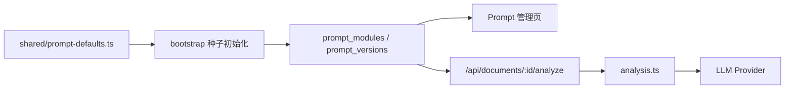

# 提示词文档

## 1. 文档目的

本文档用于说明当前项目里 Prompt 的真实来源、版本管理方式、后端消费链路、模型调用策略，以及当前 Prompt 设计存在的问题。

当前版本里最重要的事实是：

- Prompt 已从“前端单一字符串”升级为“后端数据库里的模块化版本”
- 但真正接入模型调用的，仍然主要是“用户研究”模块

## 2. 当前 Prompt 的存储位置

当前 Prompt 体系分成 3 层：

### 2.1 默认 Prompt

代码位置：

- `shared/prompt-defaults.ts`

作用：

- 作为系统初始种子
- 在数据库首次初始化或缺少模块数据时提供默认内容

### 2.2 模块定义

数据库表：

- `prompt_modules`

当前模块：

- 用户研究
- 销转研究
- 行业研究
- 舆情研究
- 员工研究

### 2.3 版本数据

数据库表：

- `prompt_versions`

字段重点包括：

- `module_code`
- `version_label`
- `status`
- `content`
- `published_at`

## 3. 当前 Prompt 的前后端流转

## 4. Prompt 管理当前能力

前端入口：

- `src/pages/SystemManagement/PromptManagement.tsx`

后端接口：

- `GET /api/prompt-modules`
- `GET /api/prompt-modules/:code/versions`
- `POST /api/prompt-modules/:code/versions`
- `PATCH /api/prompt-versions/:recordId`
- `POST /api/prompt-versions/:recordId/publish`

当前支持：

- 查看模块 Prompt
- 查看版本历史
- 保存草稿
- 发布新版本
- 自动归档旧的已发布版本

## 5. 当前真正接入模型调用的模块

当前 Prompt 管理支持 5 个模块，但真正接入真实分析链路的主要还是：

- `用户研究`

原因不是 Prompt 系统做不到，而是当前只有“用户研究 > 访谈分析”已经打通：

- 文档上传
- 文本解析
- 模型调用
- 结果持久化
- 结果展示

销转研究、舆情研究、行业研究、员工研究目前仍主要是占位页或原型页。

## 6. 当前分析调用链路

当用户点击“开始分析”时，真实链路如下：

1. 前端上传文档
2. 后端保存源文档并抽取文本
3. 前端调用 `POST /api/documents/:id/analyze`
4. 后端读取该文档所属模块的“已发布 Prompt”
5. 后端把 Prompt 和材料送入分析服务
6. 分析结果写回 `research_documents.analysis_result`

## 7. 当前模型提供方与切换逻辑

当前后端支持两个模型提供方：

- `gemini`
- `deepseek`

后端默认提供方由 `LLM_PROVIDER` 决定：

- `gemini`
- `deepseek`

如果未显式设置，则默认使用 `gemini`。

### Gemini 路径

- 使用 `@google/genai`
- 默认模型：`gemini-2.5-flash`
- Gemini 任一阶段首次失败后，会立即尝试 DeepSeek 作为 fallback
- 如果本次分析已经切到 DeepSeek，后续阶段会继续保持使用 DeepSeek
- 不再做 Gemini 模型内切换

### DeepSeek 路径

- 走 OpenAI 兼容 `chat/completions`
- 默认模型：`deepseek-chat`
- 支持显式变量 `DEEPSEEK_API_KEY / DEEPSEEK_MODEL / DEEPSEEK_BASE_URL`
- 旧的 `LLM_API_KEY / LLM_MODEL / LLM_BASE_URL` 仅作为 DeepSeek 的兼容别名

## 8. 当前分析输出协议

当前后端期望模型返回结构化 JSON，核心板块包括：

- `summary`
- `insights`
- `journey`
- `persona`
- `actions`

### 8.1 `summary`

包含：

- `conclusions`
- `decisions`

### 8.2 `insights`

每条洞察至少包含：

- `title`
- `tag`
- `user`
- `observation`
- `insight`
- `voc`

### 8.3 `journey`

每个阶段包含：

- `stage`
- `emotion`
- `behavior`
- `quote`

### 8.4 `persona`

当前更贴近实际结构的是：

- `name`
- `demographics`
- `spectrum`

其中 `spectrum` 项包含：

- `dimension`
- `left`
- `right`
- `value`
- `leftUsers`
- `rightUsers`

### 8.5 `actions`

分为：

- `product`
- `marketing`
- `design`

并且当前后端要求动作结果里的 `insightRef` 指向对应“洞察#N”。

## 9. 当前后端分析流水线

当前 `backend/src/services/analysis.ts` 已经不是旧版“多个 section 并发拆开”的实现，而是两段式：

### 第一步：主分析

一次请求生成：

- `summary`
- `insights`
- `journey`
- `persona`

### 第二步：行动建议

再用已生成的洞察作为上下文，单独生成：

- `actions`

当前前端在渲染“行动建议”页签时，还会对以下字段做中文化映射：

- 建议类型
- 紧迫程度
- 认知负荷评级

### 当前好处

- 比旧版拆得更少
- Prompt 协议更容易维护
- 洞察和行动建议之间有清晰引用关系

### 当前问题

- 仍不是单次请求
- 同一份材料仍会被重复发送至少 2 次
- 材料越长、Prompt 越长，耗时越明显

## 10. 当前 Prompt 的内容结构

以“用户研究”默认 Prompt 为例，当前内容大致分成 6 层。

## 10.1 业务背景层

提供“超级电动”的业务上下文，包括：

- 新能源电车订阅平台
- 对标 `finn`
- 两条核心业务线：超级订阅 / 灵活订阅
- 典型用户群和主力车型

## 10.2 角色设定层

把模型设定为：

- 超级电动的用户研究负责人

并通过专家能力锚点，强化它的研究分析角色而不是普通总结角色。

## 10.3 方法论层

要求模型启用：

- 定性研究
- JTBD
- 文本编码
- 情感分析
- 心智模型
- 溯因推理

## 10.4 输入规则层

包含：

- 多文档输入说明
- 人物识别规则
- 冲突信息标注规则

## 10.5 联调兜底层

要求在材料不足时，也返回符合业务语境的 mock 结构化数据，避免前端联调直接断掉。

## 10.6 输出约束层

要求只返回合法 JSON，并对各板块字段给出明确要求。

## 11. 当前 Prompt 的优点

- 业务背景足够强，能明显减少泛化空话
- 方法论密度高，适合研究分析场景
- 对人物识别和冲突信息做了明确约束
- 便于前端消费结构化结果
- 支持模块化版本治理

## 12. 当前 Prompt 的问题

### 12.1 用户研究 Prompt 仍然过长

它混合了：

- 业务背景
- 方法论
- 工程兜底规则
- 输出约束

长期维护成本高。

### 12.2 其他模块 Prompt 仍较薄

除“用户研究”外，其他模块默认 Prompt 目前更接近占位型描述，还没有和具体页面能力深度绑定。

### 12.3 Prompt 和页面能力仍不完全同步

Prompt 管理已经是多模块版本治理，但真正接入真实分析链路的模块还不多。

### 12.4 当前尚未建立 Prompt 评测体系

当前 Prompt 优化主要依赖：

- 使用反馈
- 人工观察

尚未形成自动化评测样本。

## 13. 当前 Prompt 治理建议

建议后续把 Prompt 拆成更稳定的 4 层：

### 13.1 背景知识层

- 公司背景
- 业务线定义
- 术语和规则

### 13.2 模块角色层

- 用户研究
- 销转研究
- 行业研究
- 舆情研究
- 员工研究

### 13.3 任务协议层

- 单文档分析
- 多文档比较
- 画像汇总
- 行动建议生成

### 13.4 输出协议层

- 结构字段
- 字段含义
- 前端依赖项

当前前端的几个补充展示规则：

- “旅程图”页签使用固定列数的横向滚动布局，不允许阶段卡片自动掉到下一行
- “完整报告”页签直接复用速览、旅程图、洞察、画像、行动建议这 5 个板块的结果拼接生成
- “行动建议”页签会把模型返回的常见英文枚举值映射成中文后再展示

## 14. 当前已确认的优化方向

- 尽量收敛为单次结构化输出
- 为分析结果增加缓存
- 缩短 Prompt 重复发送的上下文
- 为不同模块建立更贴业务的专属 Prompt
- 为 Prompt 变更引入评测样本和回归验证
